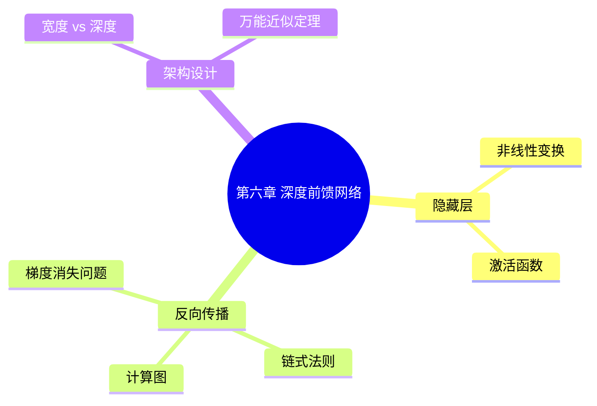

# Claude Book Reader — 项目规划与技术方案

> 一个基于 PyQt6 + PyMuPDF 的 PDF 图书管理与阅读器，深度集成 Claude Code 实现智能阅读辅助、笔记优化与知识图谱构建。

---

## 目录

1. [项目概述](#1-项目概述)
2. [技术栈总览](#2-技术栈总览)
3. [项目结构](#3-项目结构)
4. [模块一：PDF 核心引擎](#4-模块一pdf-核心引擎)
5. [模块二：图书管理系统](#5-模块二图书管理系统)
6. [模块三：阅读视图与交互](#6-模块三阅读视图与交互)
7. [模块四：笔记系统](#7-模块四笔记系统)
8. [模块五：Claude Code 集成](#8-模块五claude-code-集成)
9. [模块六：知识图谱](#9-模块六知识图谱)
10. [模块七：Obsidian 仓库同步](#10-模块七obsidian-仓库同步)
11. [模块八：阅读统计与辅助功能](#11-模块八阅读统计与辅助功能)
12. [数据库设计](#12-数据库设计)
13. [Claude Code Skill 设计](#13-claude-code-skill-设计)
14. [UI 布局设计](#14-ui-布局设计)
15. [分阶段实施计划](#15-分阶段实施计划)
16. [技术风险与对策](#16-技术风险与对策)

---

## 1. 项目概述

### 1.1 项目目标

打造一个**以阅读为中心、AI 贯穿全流程**的 PDF 阅读器，实现：

- 专业的 PDF 阅读体验（多种阅读模式、书签、笔记）
- 与 Claude Code 的无缝交互（选中文字/截图 → 提问 → AI 回答）
- 从阅读前（计划、大纲）→ 阅读中（实时问答）→ 阅读后（笔记优化、知识图谱）的完整闭环
- 输出到 Obsidian 的个人知识仓库

### 1.2 核心工作流

```
┌──────────────────────────────────────────────────────────────────┐
│                        阅读全流程                                  │
├─────────────┬──────────────────┬─────────────────────────────────┤
│  阅读前      │    阅读中          │   阅读后                         │
├─────────────┼──────────────────┼─────────────────────────────────┤
│ 导入PDF      │ 选择阅读模式       │ 笔记优化 (Claude)                │
│ 自动提取目录  │ 创建书签/笔记      │ 概念提取 → 知识图谱              │
│ 章节分析     │ 选中文字 → 问Claude │ 导出 Obsidian 仓库              │
│ 阅读计划     │ 区域截图 → 问Claude │ 跨书概念关联                    │
│ 阅读大纲     │ 全文搜索          │ 阅读统计复盘                     │
└─────────────┴──────────────────┴─────────────────────────────────┘
```

---

## 2. 技术栈总览

| 层级 | 技术选型 | 说明 |
|---|---|---|
| GUI 框架 | **PyQt6** (>= 6.5) | 成熟稳定的桌面 GUI，丰富的 widget 体系，支持 QGraphicsView 高性能渲染 |
| PDF 引擎 | **PyMuPDF** (fitz, >= 1.23) | C 级性能，支持渲染、文字提取、TOC、批注读写 |
| 数据存储 | **JSON + YAML 文件** | 所有数据以 JSON/YAML 纯文本存储，用户可手动编辑，Git 友好，便于开源部署 |
| 全文检索 | **Whoosh** (纯 Python) | 纯 Python 实现的全文检索引擎，无需外部依赖，索引存储在本地文件 |
| 知识图谱 | **NetworkX** | 图数据结构与算法，支持多种布局算法 |
| 图可视化 | **PyQt6 QGraphicsView** + NetworkX 布局 | 在应用内绘制简易知识图谱；丰富可视化由 Obsidian Graph View 完成 |
| Markdown 渲染 | **markdown2** + **Pygments** + 自定义 QTextBrowser | Python 渲染 markdown 为 HTML，在 QTextBrowser 中展示 |
| 截图处理 | **Pillow** (PIL) | 截图区域的编码/解码、临时文件管理 |
| Claude 通信 | **subprocess** + Claude Code CLI | 每本书打开时启动常驻 agent 子进程，通过 stdin/stdout 通信，保持会话连贯性 |
| 配置文件 | **YAML** (PyYAML) | 应用配置、用户偏好 |
| 模板渲染 | **Jinja2** | Obsidian 笔记模板渲染 |

### 2.1 Conda 环境

```bash
conda activate bookreader
pip install PyQt6 PyMuPDF networkx markdown2 pygments pillow pyyaml jinja2 whoosh
```

---

## 3. 项目结构

```
claude-book-reader/
├── src/
│   ├── __init__.py
│   ├── main.py                     # 应用入口
│   ├── app.py                      # QApplication 初始化、全局样式
│   │
│   ├── ui/                         # UI 层
│   │   ├── __init__.py
│   │   ├── main_window.py          # 主窗口（布局编排）
│   │   ├── library_panel.py        # 左侧：图书库面板
│   │   ├── reading_view.py         # 中央：阅读视图容器
│   │   ├── reading_toolbar.py      # 阅读工具栏（模式切换、缩放等）
│   │   ├── notes_panel.py          # 右侧：笔记面板
│   │   ├── claude_panel.py         # 底部：Claude 交互终端
│   │   ├── status_bar.py           # 底部状态栏
│   │   ├── dialogs/
│   │   │   ├── __init__.py
│   │   │   ├── add_book.py         # 导入图书对话框
│   │   │   ├── book_info.py        # 图书元数据编辑
│   │   │   ├── tag_manager.py      # 标签管理
│   │   │   ├── settings.py         # 设置对话框
│   │   │   └── reading_plan.py     # 阅读计划配置
│   │   └── widgets/
│   │       ├── __init__.py
│   │       ├── page_canvas.py      # 单页渲染画布（QGraphicsView）
│   │       ├── page_item.py        # 单页 QGraphicsItem
│   │       ├── selection_overlay.py # 文字选区覆盖层
│   │       ├── screenshot_tool.py  # 截图选区工具
│   │       ├── bookmark_widget.py  # 书签列表组件
│   │       ├── markdown_viewer.py  # Markdown 渲染查看器
│   │       ├── tag_chip.py         # 标签芯片组件
│   │       ├── terminal_widget.py  # 终端输入输出组件
│   │       └── graph_canvas.py     # 知识图谱画布
│   │
│   ├── core/                       # 核心业务层
│   │   ├── __init__.py
│   │   ├── library.py              # 图书库管理器
│   │   ├── book.py                 # 图书模型 (dataclass)
│   │   ├── storage.py              # JSON/YAML 文件读写封装
│   │   ├── search_engine.py        # Whoosh 全文检索引擎
│   │   ├── statistics.py           # 阅读统计
│   │   └── config.py               # 应用配置管理
│   │
│   ├── reader/                     # PDF 阅读引擎
│   │   ├── __init__.py
│   │   ├── pdf_engine.py           # PyMuPDF 封装（打开/关闭/缓存）
│   │   ├── page_renderer.py        # PDF 页面 → QImage 渲染
│   │   ├── text_extractor.py       # 文字提取与坐标映射
│   │   ├── toc_parser.py           # 目录解析
│   │   ├── reading_modes.py        # 阅读模式策略（单页/双页/连续/翻页）
│   │   └── navigation.py           # 页码导航、跳转
│   │
│   ├── notes/                      # 笔记系统
│   │   ├── __init__.py
│   │   ├── note_manager.py         # 笔记 CRUD
│   │   ├── annotation.py           # PDF 内嵌批注读写
│   │   └── obsidian_exporter.py    # Obsidian 仓库导出
│   │
│   ├── claude/                     # Claude Code 集成
│   │   ├── __init__.py
│   │   ├── claude_agent.py         # 常驻 agent 进程管理（每本书一个）
│   │   ├── claude_client.py        # Claude CLI 单次调用封装
│   │   ├── context_builder.py      # 上下文文件构建器
│   │   ├── prompt_templates.py     # 预设 Prompt 模板
│   │   └── skill_loader.py         # Skill 定义加载
│   │
│   ├── knowledge/                  # 知识图谱
│   │   ├── __init__.py
│   │   ├── graph_engine.py         # NetworkX 图谱引擎
│   │   ├── concept_extractor.py    # 概念提取（调用 Claude）
│   │   └── visualizer.py           # 图可视化渲染
│   │
│   └── utils/                      # 工具函数
│       ├── __init__.py
│       ├── file_utils.py           # 文件操作辅助
│       ├── image_utils.py          # 图片处理辅助
│       └── logger.py               # 日志
│
├── skills/                         # Claude Code Skill 定义
│   └── book-reader.md
│
├── resources/
│   ├── icons/                      # SVG/PNG 图标
│   ├── styles/
│   │   ├── light.qss              # 亮色主题 QSS
│   │   └── dark.qss               # 暗色主题 QSS
│   └── templates/
│       └── obsidian/               # Obsidian 模板文件
│           ├── book-note.md.j2     # 书籍笔记模板
│           ├── chapter-note.md.j2  # 章节笔记模板
│           ├── concept.md.j2       # 概念页模板
│           ├── quote.md.j2         # 摘录模板
│           └── moc.md.j2           # Map of Content 模板
│
├── obsidian-vault/                 # 生成的 Obsidian 仓库（默认输出位置）
│   ├── .obsidian/                  # Obsidian 配置
│   ├── Books/                      # 书籍笔记目录
│   ├── Concepts/                   # 概念笔记目录
│   ├── Tags/                       # 标签索引
│   ├── Daily/                      # 阅读日记
│   └── _MOCs/                      # Map of Content 汇总页
│
├── tests/
│   ├── __init__.py
│   ├── test_storage.py
│   ├── test_pdf_engine.py
│   ├── test_note_manager.py
│   ├── test_search_engine.py
│   ├── test_graph_engine.py
│   └── test_obsidian_export.py
│
├── data/                            # 用户数据目录模板（首次运行自动创建于 ~/.claude-book-reader/）
│   ├── config.yaml                  # 应用配置
│   ├── library.json                 # 图书库元数据
│   ├── categories.json              # 分类树
│   ├── tags.json                    # 标签列表
│   ├── bookmarks.json               # 所有书签
│   ├── reading_sessions.json        # 阅读记录
│   ├── concepts.json                # 知识图谱节点
│   ├── concept_links.json           # 知识图谱边
│   └── books/
│       └── <book_uuid>/
│           ├── metadata.json        # 单书元数据
│           └── text_cache/          # 提取的文字缓存（供搜索）
│
├── requirements.txt
├── setup.py
└── README.md
```

---

## 4. 模块一：PDF 核心引擎

### 4.1 技术方案

**PyMuPDF (fitz)** 作为唯一 PDF 后端，覆盖所有 PDF 操作需求：

| 功能 | PyMuPDF API | 说明 |
|---|---|---|
| 页面渲染 | `page.get_pixmap(matrix=...)` | 渲染为像素图，通过 matrix 控制缩放 |
| 文字提取 | `page.get_text("words")` | 按词提取，包含 bbox 坐标 `(x0,y0,x1,y1)` |
| 文字搜索 | `page.search_for("keyword")` | 返回匹配区域的矩形坐标列表 |
| 目录提取 | `doc.get_toc()` | 返回 `[level, title, page]` 嵌套列表 |
| 批注读写 | `page.annots()` / `page.add_highlight_annot()` | 读取/创建 PDF 内嵌批注 |
| 元数据 | `doc.metadata` | 标题、作者、主题等 |

### 4.2 页面渲染管线

```
PDF 文件
  │
  ▼
fitz.open(filepath)                          # 打开文档
  │
  ▼
PageCache ─── 检查缓存 ─── 命中 → 返回 QPixmap
  │                              │
  │ 未命中                        │
  ▼                              │
page.get_pixmap(                   │
  matrix=fitz.Matrix(zoom, zoom)   │
)                                  │
  │                                │
  ▼                                │
pixmap.samples → QImage ──→ QPixmap ──→ 缓存 ──→ 渲染到屏幕
  (RGB 字节流)     (Qt 图像)   (Qt 像素图)
```

### 4.3 页面缓存策略

```python
class PageCache:
    """
    LRU 缓存，默认缓存当前页 ± 前后各 5 页（共 11 页）
    对于双页模式，缓存足够的页面覆盖可见区域
    """
    MAX_CACHED_PAGES = 20
    PRELOAD_AHEAD = 5
    PRELOAD_BEHIND = 5

    # key: (page_number, zoom_level), value: QPixmap
    def get(self, page_num: int, zoom: float) -> QPixmap | None
    def put(self, page_num: int, zoom: float, pixmap: QPixmap)
    def preload_range(self, start: int, end: int, zoom: float)
    def clear_on_zoom_change(self, new_zoom: float)
```

### 4.4 文字提取与坐标映射

PyMuPDF 的坐标原点在页面**左上角**，需要映射到屏幕坐标：

```
PDF 坐标 (y 向下)         屏幕坐标 (y 向下)
     ┌──────┐                ┌──────┐
     │      │                │      │
     │ text │   ──zoom──→    │ text │
     │      │                │      │
     └──────┘                └──────┘

screen_x = pdf_x * zoom + offset_x
screen_y = pdf_y * zoom + offset_y
screen_w = pdf_w * zoom
screen_h = pdf_h * zoom
```

其中 `offset` 由阅读模式决定（单页居中、双页左/右偏移等）。

---

## 5. 模块二：图书管理系统

### 5.1 图书库模型

```
Library (图书库)
  ├── Books (书籍列表)
  │     ├── 书籍元数据 (标题、作者、ISBN、出版社、年份、页数)
  │     ├── 文件路径
  │     ├── 阅读状态 (未读/阅读中/已读完)
  │     ├── 阅读进度 (当前页/总页数)
  │     └── 封面缩略图
  ├── Categories (分类)
  │     └── 树形结构，支持父子分类
  └── Tags (标签)
        └── 扁平标签 + 颜色标记
```

### 5.2 分类系统

- **树形分类**：学科/领域 二层结构。例如：
  ```
  计算机科学/
    ├── 机器学习
    ├── 系统设计
    └── 编程语言
  人文社科/
    ├── 哲学
    └── 历史
  ```
- **标签**：跨分类的灵活标记。例如：`#重点阅读` `#入门` `#经典` `#论文`
- **阅读状态自动流转**：首次打开 → 阅读中，翻到最后一页 → 已读完

### 5.3 书架视图

提供三种浏览模式：

| 视图 | 说明 |
|---|---|
| **网格视图** | 封面缩略图网格，适合浏览 |
| **列表视图** | 详细信息列表，支持排序（书名/作者/最近阅读/进度） |
| **分类树视图** | 左侧分类树 + 右侧书籍列表 |

### 5.4 全文检索

基于 **Whoosh**（纯 Python 全文检索引擎）实现：

```python
from whoosh import index
from whoosh.fields import Schema, TEXT, ID, NUMERIC
from whoosh.qparser import MultifieldParser

# Schema 定义
schema = Schema(
    book_id=ID(stored=True),
    page_number=NUMERIC(stored=True),
    content=TEXT(stored=True)
)

# 创建/打开索引
idx = index.open_dir("~/.claude-book-reader/search_index")

# 搜索
with idx.searcher() as searcher:
    query = MultifieldParser(["content"], schema).parse('"machine learning" AND neural')
    results = searcher.search(query)
    for hit in results:
        print(f"Book: {hit['book_id']}, Page: {hit['page_number']}")
```

**建索引流程**：
1. 导入新书时，后台逐页提取文字
2. 写入 Whoosh 索引（每页一条记录）
3. 索引进度保存到 `books/<uuid>/metadata.json` 中的 `indexed_pages` 字段，支持断点续建
4. 索引目录：`~/.claude-book-reader/search_index/`

---

## 6. 模块三：阅读视图与交互

### 6.1 阅读模式架构

使用**策略模式**实现四种阅读模式：

```
ReadingMode (抽象基类)
  │
  ├── SinglePageContinuous   # 单页连续滚动
  ├── DoublePageContinuous   # 双页连续滚动
  ├── SinglePageFlip         # 单页翻页
  └── DoublePageFlip         # 双页翻页
```

### 6.2 各模式详解

#### 单页连续滚动 (SinglePageContinuous)

```
┌──────────────┐
│   Page 1     │
│              │
├──────────────┤  ← 连续垂直排列
│   Page 2     │    使用 QScrollArea + 垂直布局
│              │    滚轮 → 平滑滚动
├──────────────┤
│   Page 3     │
│              │
└──────────────┘
```

**实现**：QScrollArea 内含一个 QVBoxLayout，每个页面是一个 QLabel/QGraphicsView。仅渲染可见页 + 前后预加载，虚拟化列表中不可见的页面用占位符替代。

#### 双页连续滚动 (DoublePageContinuous)

```
┌──────┬──────┐
│ Pg 1 │ Pg 2 │  ← 第一行：封面（单独居中）或 P1+P2
├──────┼──────┤
│ Pg 3 │ Pg 4 │  ← 水平两列，垂直连续
├──────┼──────┤
│ Pg 5 │ Pg 6 │
└──────┴──────┘
```

**注意**：第一页（通常是封面）单独居中展示，从第二页开始按 `(2,3) → (4,5) → ...` 配对。需要处理封底（最后一页奇数时单独居中）。

#### 单页翻页 (SinglePageFlip)

```
┌──────────────┐
│              │
│   Page N     │  ← 每次只显示一页
│              │    点击右侧 / 右箭头 → 下一页
└──────────────┘    点击左侧 / 左箭头 → 上一页
```

翻页采用静态切换，无动画过渡。

#### 双页翻页 (DoublePageFlip)

```
┌──────┬──────┐
│ Pg N │PgN+1 │  ← 每次显示两页（模拟打开的书）
│      │      │    点击右侧 → 翻两页（N+2, N+3）
└──────┴──────┘    点击左侧 → 回两页
```

### 6.3 缩放与适配

| 操作 | 快捷键 | 说明 |
|---|---|---|
| 放大 | `Ctrl+=` / `Ctrl+滚轮上` | 缩放步长 10% |
| 缩小 | `Ctrl+-` / `Ctrl+滚轮下` | 缩放步长 10% |
| 适应宽度 | `Ctrl+W` | 页面宽度 = 视图宽度 |
| 适应页面 | `Ctrl+F` | 整页可见 |
| 原始大小 | `Ctrl+0` | 100% |

### 6.4 文字选中

**实现原理**：

```
1. 鼠标按下 → 记录 PDF 坐标
2. 鼠标移动 → 实时计算选区矩形（屏幕坐标 → PDF 坐标）
3. 鼠标释放 →
   a. 调用 page.get_text("words") 获取该页所有词的坐标
   b. 筛选出在选区矩形内的词
   c. 拼接为选中文本
4. 显示半透明蓝色选区覆盖层
5. 弹出浮动菜单：「问 Claude」「复制」「笔记」「翻译」「高亮」
```

**浮动菜单**：选中文字后在选区附近弹出的 QMenu / 自定义 QWidget：

```
┌──────────────────────────┐
│  🤖 问 Claude  │  📝 笔记 │
│  📋 复制       │  🌐 翻译 │
│  🖍️ 高亮       │         │
└──────────────────────────┘
```

### 6.5 截图选区

**实现原理**：

```
1. 用户点击工具栏「截图」按钮或按 Ctrl+Shift+S
2. 进入截图模式：屏幕变暗 20%，光标变为十字
3. 用户拖拽选区矩形（QRubberBand）
4. 释放鼠标：
   a. 调用 QPixmap.grabWidget() 截取选区
   b. 保存为临时 PNG 文件
   c. 在 Claude 面板中显示缩略图预览
   d. 自动在终端中填充 prompt 前缀
5. 退出截图模式
```

### 6.6 书签系统

```
书签数据结构:
  - book_id
  - page_number
  - title (可选，默认显示页码)
  - chapter_title (自动从 TOC 匹配)
  - created_at
  - note (可选附注)

书签面板:
  ┌─────────────────┐
  │ 🔖 书签列表      │
  ├─────────────────┤
  │ 📍 P12 引言      │  ← 点击跳转
  │ 📍 P45 第三章    │
  │ 📍 P89 关键公式  │
  └─────────────────┘
```

---

## 7. 模块四：笔记系统

### 7.1 笔记类型

| 类型 | 存储位置 | 数据结构 |
|---|---|---|
| **页面锚点笔记** | Obsidian 仓库 markdown + PDF 内嵌批注 | `(book_id, page, x, y, content)` |
| **文字高亮** | PDF 内嵌批注 (Highlight Annotation) | 通过 PyMuPDF 创建 |
| **自由笔记** | Obsidian 仓库 markdown | `(book_id, chapter, content)` |
| **章节摘要** | Obsidian 仓库 | 由 Claude 生成后保存 |

### 7.2 笔记面板

```
┌──────────────────────────┐
│ 📝 笔记         [+ 新建]  │
├──────────────────────────┤
│ 页面锚点笔记 (跟随翻页)    │
│ ┌──────────────────────┐ │
│ │ P12: 这里讲的是...    │ │
│ │ 2024-05-20 14:30     │ │
│ │ [编辑] [优化] [删除]  │ │
│ └──────────────────────┘ │
│ ┌──────────────────────┐ │
│ │ P12: 另一个角度思考... │ │
│ │ 2024-05-20 15:00     │ │
│ └──────────────────────┘ │
│                          │
│ 本章笔记 (当前章节聚合)    │
│ ┌──────────────────────┐ │
│ │ 第三章的核心观点是...  │ │
│ └──────────────────────┘ │
│                          │
│ 全局笔记                  │
│ ┌──────────────────────┐ │
│ │ 这本书给我的启发...    │ │
│ └──────────────────────┘ │
└──────────────────────────┘
```

### 7.3 Claude 笔记优化

**流程**：

```
用户选中一条/多条笔记
  │
  ▼
点击「✨ 优化笔记」
  │
  ▼
Claude 接收：
  - 笔记原始内容
  - 所在章节上下文（前后几页文字）
  - 书籍元数据
  │
  ▼
Claude 输出优化后的笔记：
  - 结构化表述（bullet points / 表格）
  - 补充关联概念
  - 标记潜在问题或思考方向
  - 生成 Obsidian 双链 [[引用]]
```

**优化选项**（用户可选择优化风格）：
- **精炼**：压缩冗余，提炼核心
- **结构化**：重新组织为层级结构
- **扩展**：补充背景知识和延伸阅读建议
- **批判性**：从多角度审视观点

---

## 8. 模块五：Claude Code 集成

### 8.1 集成架构：每本书常驻 Agent 进程

核心设计理念：**打开一本书 → 启动一个专属 Claude agent 进程，保持会话连贯，关闭书籍 → 终止进程**。

```
┌─────────────────────────────────────────────────────────────┐
│                      Book Reader (PyQt6)                     │
│                                                              │
│  ┌──────────┐    ┌──────────┐    ┌──────────┐               │
│  │ Book A   │    │ Book B   │    │ Book C   │   (多标签)     │
│  │ 打开中    │    │ 打开中    │    │ 未打开    │               │
│  └────┬─────┘    └────┬─────┘    └──────────┘               │
│       │               │                                      │
│       ▼               ▼                                      │
│  ┌──────────┐    ┌──────────┐                               │
│  │ Agent A  │    │ Agent B  │   常驻子进程 (QProcess)        │
│  │ pid: 123 │    │ pid: 456 │   stdin/stdout 管道通信        │
│  │ 会话: 15条│   │ 会话: 3条 │   上下文全在内存中              │
│  └──────────┘    └──────────┘                               │
│                                                              │
│  每个 Agent 维护:                                             │
│  - 该书完整的对话历史                                          │
│  - 书籍元数据与目录 (初始注入)                                  │
│  - 用户偏好与分析上下文                                        │
└─────────────────────────────────────────────────────────────┘
```

**优势**：
- **无冷启动**：首次提问后，后续交互无需重新加载书籍上下文
- **连贯理解**：agent 记住之前讨论过的概念，追问和深入讨论体验自然
- **隔离性**：每本书独立 agent，互不干扰
- **资源可控**：关闭书籍时自动终止 agent，释放资源

### 8.2 上下文文件协议

阅读器将当前交互上下文写入 JSON 文件，Claude Code Skill 读取该文件来获取完整信息：

```json
{
  "version": "1.0",
  "timestamp": "2026-05-24T15:30:00",
  "action": "analyze_text",
  "book": {
    "title": "Deep Learning",
    "author": "Ian Goodfellow",
    "current_page": 156,
    "total_pages": 800,
    "current_chapter": "Chapter 6: Deep Feedforward Networks",
    "toc": [
      {"level": 1, "title": "Chapter 6", "page": 150},
      {"level": 2, "title": "6.1 Example: Learning XOR", "page": 152}
    ]
  },
  "context": {
    "type": "text_selection",
    "selected_text": "The back-propagation algorithm...",
    "surrounding_text": "In this section, we discuss...",
    "page": 156,
    "bbox": {"x0": 100, "y0": 200, "x1": 400, "y1": 250}
  },
  "screenshot_path": null,
  "user_query": "请用通俗的例子解释这段话",
  "history": [
    {"role": "user", "content": "什么是反向传播？"},
    {"role": "assistant", "content": "反向传播是..."}
  ]
}
```

### 8.3 Claude Agent 生命周期

```python
class ClaudeAgent(QObject):
    """
    封装一个常驻的 Claude Code 子进程，与一本书绑定。

    生命周期:
        打开书籍 → start()
        发送消息 → send_message()
        流式接收 → readyReadStandardOutput 信号
        关闭书籍 → terminate()
    """

    # 信号
    response_chunk = pyqtSignal(str)       # 流式响应片段
    response_finished = pyqtSignal(str)    # 完整响应
    error_occurred = pyqtSignal(str)       # 错误信息

    def __init__(self, book_metadata: dict, parent=None):
        super().__init__(parent)
        self.book = book_metadata
        self.process: QProcess | None = None
        self.session_id = f"book-{uuid.uuid4().hex[:8]}"

    def start(self):
        """
        启动常驻 Claude 进程：

        1. 通过 stdin 注入初始上下文（书籍元数据、目录、Skill 指令）
        2. 进程保持运行，等待后续交互
        3. 使用 --session-id 保持会话标识
        """
        self.process = QProcess(self)
        self.process.setProcessChannelMode(QProcess.SeparateChannels)
        self.process.readyReadStandardOutput.connect(self._on_stdout)
        self.process.readyReadStandardError.connect(self._on_stderr)
        self.process.finished.connect(self._on_finished)

        # 启动 Claude Code 进入交互模式
        # 使用 --resume 或 --continue 保持会话连续性
        args = [
            "claude",
            "--session-id", self.session_id,
            "--output-format", "stream-json",
        ]
        self.process.start(args[0], args[1:])

        # 注入初始上下文（书籍信息 + Skill 指令）
        init_prompt = self._build_init_prompt()
        self._write_stdin(init_prompt)

    def send_message(self, context: ClaudeContext):
        """
        发送用户问题到 agent：
        1. 构建包含当前交互上下文的消息
        2. 通过 stdin 写入子进程
        3. agent 处理后在 stdout 输出响应
        """
        message = self._build_message(context)
        self._write_stdin(message)

    def terminate(self):
        """关闭书籍时终止 agent 进程"""
        if self.process and self.process.state() != QProcess.NotRunning:
            self._write_stdin("/exit\n")
            self.process.waitForFinished(3000)
            if self.process.state() != QProcess.NotRunning:
                self.process.kill()

    def _build_init_prompt(self) -> str:
        """构建初始上下文注入 prompt"""
        return json.dumps({
            "action": "init_session",
            "skill": "book-reader",
            "book": {
                "title": self.book["title"],
                "author": self.book["author"],
                "total_pages": self.book["pages"],
                "toc": self.book["toc"]
            }
        }) + "\n"

    def _build_message(self, context: ClaudeContext) -> str:
        """构建交互消息"""
        return json.dumps({
            "action": context.action,
            "context": context.to_dict(),
            "user_query": context.user_query,
            "history": context.history
        }) + "\n"

    def _write_stdin(self, data: str):
        """向子进程 stdin 写入数据"""
        if self.process and self.process.state() == QProcess.Running:
            self.process.write(data.encode("utf-8"))

    def _on_stdout(self):
        """处理 agent 流式输出"""
        data = self.process.readAllStandardOutput().data().decode("utf-8")
        self.response_chunk.emit(data)

    def _on_stderr(self):
        """处理错误输出"""
        err = self.process.readAllStandardError().data().decode("utf-8")
        if err.strip():
            self.error_occurred.emit(err)

    def _on_finished(self, exit_code: int):
        """agent 进程退出处理"""
        if exit_code != 0:
            self.error_occurred.emit(f"Agent process exited with code {exit_code}")


class ClaudeAgentManager:
    """
    管理所有书籍的 agent 进程。

    职责：
    - book_opened(book_id)  → 创建并启动 agent
    - book_closed(book_id)  → 终止并清理 agent
    - get_agent(book_id)    → 获取活跃 agent
    - 资源监控：限制最大并发 agent 数量（默认 3 个）
    """

    MAX_AGENTS = 3

    def __init__(self):
        self._agents: dict[str, ClaudeAgent] = {}

    def book_opened(self, book_id: str, metadata: dict) -> ClaudeAgent:
        if len(self._agents) >= self.MAX_AGENTS:
            oldest = next(iter(self._agents))
            self.book_closed(oldest)
        agent = ClaudeAgent(metadata)
        agent.start()
        self._agents[book_id] = agent
        return agent

    def book_closed(self, book_id: str):
        if agent := self._agents.pop(book_id, None):
            agent.terminate()

    def get_agent(self, book_id: str) -> ClaudeAgent | None:
        return self._agents.get(book_id)
```

### 8.4 单次调用模式（兼容保留）

对于不需要持久上下文的场景（如翻译、概念提取），保留简化的单次调用路径：

```python
class ClaudeClient:
    """
    轻量级单次调用封装，用于简单的、无需多轮对话的任务。
    也作为 agent 不可用时的 fallback。
    """

    def invoke_once(self, context: ClaudeContext) -> str:
        """写入上下文文件 → claude -p 单次调用 → 返回结果"""
        ctx_path = self._write_context_file(context)
        result = subprocess.run(
            ["claude", "-p", f"/book-reader {ctx_path}"],
            capture_output=True, text=True, timeout=120
        )
        return result.stdout
```

### 8.5 终端面板设计

```
┌──────────────────────────────────────────────────────────┐
│  🤖 Claude  · 当前上下文: 《Deep Learning》P156 选中文字  [×] │  ← 上下文标签
├──────────────────────────────────────────────────────────┤
│                                                          │
│  ┌─ 上下文预览 ──────────────────────────────────────┐   │
│  │  📎 选中文字 (42 字):                             │   │
│  │  "The back-propagation algorithm computes the     │   │
│  │   gradient of the cost function..."               │   │
│  │                                                   │   │
│  │  [🖼️ 截图预览]                         [清除上下文] │   │
│  └──────────────────────────────────────────────────┘   │
│                                                          │
│  ───────────────────────────────────────────────        │
│                                                          │
│  你 (15:30):                                             │
│  ▎ 请用通俗的例子解释这段话                              │
│                                                          │
│  Claude (15:30:15):                                      │
│  ┌──────────────────────────────────────────────────┐   │
│  │ 反向传播可以类比为...                              │   │
│  │                                                  │   │
│  │ **通俗例子**：                                    │   │
│  │ 1. 想象你在调试一个复杂的管道系统...               │   │
│  │ 2. 你从最终的出水口（输出）...                     │   │
│  │                                                  │   │
│  │ *注：该概念与 [[梯度下降]] 密切相关*               │   │
│  └──────────────────────────────────────────────────┘   │
│                                                          │
│  ▎ ▌                                                      │  ← 输入光标
│  [发送] [清空] [保存到笔记] [复制]                         │
└──────────────────────────────────────────────────────────┘
```

### 8.6 交互场景汇总

| 场景 | 触发方式 | 上下文内容 | Claude 执行任务 |
|---|---|---|---|
| **选中文本问答** | 选中文字 → 菜单「问 Claude」 | 选中文字 + 上下文 | 解释/翻译/展开/批判 |
| **截图问答** | Ctrl+Shift+S → 选区 → 输入问题 | 截图 PNG + 用户问题 | 分析图表/公式/排版内容 |
| **章节分析** | 工具栏「章节分析」 | 当前章节全文 | 生成摘要、关键概念、讨论问题 |
| **阅读计划** | 工具栏「阅读计划」 | 全书 TOC + 页数 | 生成阅读计划、时间估计、重点标注 |
| **阅读大纲** | 工具栏「阅读大纲」 | 全书 TOC | 生成详细大纲、概念依赖图 |
| **笔记优化** | 笔记面板「优化」按钮 | 选中的笔记内容 | 结构化/精炼/扩展笔记 |
| **概念提取** | 笔记面板「提取概念」 | 当前章笔记 | 提取关键概念，建立双链 |
| **自由问答** | 终端面板直接输入 | 当前书籍/章节 | 任何用户想问的问题 |

### 8.7 Prompt 模板管理

```python
PROMPT_TEMPLATES = {
    "explain_text": """
你是一位知识渊博的阅读导师。用户在阅读《{book_title}》时选中了以下文字，请帮助解释：

**选中文字**：
{selected_text}

**上下文**（同一段落/章节的附近文字）：
{surrounding_text}

**用户问题**：
{user_query}

请提供清晰、深入的解释。如果涉及专业概念，请用例子说明。
""",

    "chapter_analysis": """
请分析《{book_title}》的第 {chapter} 章：

**章节内容**：
{chapter_text}

请提供：
1. 核心观点（3-5 条）
2. 关键概念列表
3. 与其他章节的可能关联
4. 3 个值得深入思考的问题
5. 建议的补充阅读方向
""",

    "reading_plan": """
请根据以下书籍信息制定阅读计划：

**书名**：{book_title}
**作者**：{author}
**总页数**：{total_pages}
**目录**：
{toc}

请提供：
1. 分阶段阅读计划（按章节或主题分组）
2. 每阶段的预计时间
3. 重点章节标记
4. 建议的阅读顺序（是否可以跳读）
5. 阅读各阶段的目标检查点
""",

    "optimize_notes": """
请优化以下阅读笔记：

**书名**：{book_title}
**章节**：{chapter}
**原始笔记**：
{original_notes}

优化要求：{optimization_style}

请输出优化后的笔记，使用 Obsidian 兼容的 Markdown 格式，适当使用 [[双链]] 关联概念。
""",

    "extract_concepts": """
请从以下笔记中提取关键概念，用于构建知识图谱：

**笔记内容**：
{notes_content}

请为每个概念提供：
- 概念名称（简洁，适合作为 Obsidian 笔记标题）
- 简短描述（1-2 句）
- 与其他概念的关系（IS_A / RELATED_TO / PART_OF / LEADS_TO）
- 关系强度（1-10）

输出 JSON 格式。
""",

    "analyze_screenshot": """
用户在阅读《{book_title}》时截取了以下图片区域并提出问题。

**用户问题**：
{user_query}

请根据截图内容进行分析和回答。截图可能是图表、公式、代码或排版内容。
如果截图中有文字，请识别并引用。
如果截图中有图表，请解释图表传达的信息。
""",
}
```

---

## 9. 模块六：知识图谱

### 9.1 数据模型

```
Concept (概念节点)
  ├── id
  ├── name         (如: "反向传播")
  ├── description  (如: "一种通过链式法则计算神经网络梯度的算法")
  ├── aliases      (如: ["backprop", "BP", "误差反向传播"])
  └── source_books [{book_id, chapter, page}]

ConceptLink (概念边)
  ├── source_id
  ├── target_id
  ├── relation_type (IS_A / RELATED_TO / PART_OF / LEADS_TO / APPLIES_TO)
  └── strength (1-10)
```

### 9.2 概念提取流程

```
阅读笔记 (Markdown)
  │
  ▼
Claude 分析 ──→ 提取 [概念列表 + 关系]
  │
  ▼
去重与合并 (按名称 + 别名模糊匹配)
  │
  ▼
存入 concepts.json / concept_links.json
  │
  ▼
增量更新图谱 (NetworkX)
  │
  ▼
可视化渲染 (应用内) + 导出 (Obsidian Graph)
```

### 9.3 图可视化

**应用内简易图谱**：使用 QGraphicsView 渲染 NetworkX 布局结果。

```
        ┌─────────┐
        │ 深度学习 │
        └────┬────┘
             │ RELATED_TO
    ┌────────┼────────┐
    ▼        ▼        ▼
┌───────┐ ┌────┐ ┌──────┐
│反向传播│ │CNN │ │RNN   │
└───┬───┘ └─┬──┘ └──┬───┘
    │       │       │
    ▼       ▼       ▼
┌───────┐ ┌────┐ ┌──────┐
│链式法则│ │卷积│ │序列模型│
└───────┘ └────┘ └──────┘
```

**交互**：
- 拖拽节点
- 滚动缩放
- 点击节点 → 展开相关概念
- 双击节点 → 跳转到对应书籍/章节
- 过滤：按书籍、按关系类型、按强度

**NetworkX 布局选择**：
- `spring_layout`：力导向布局，适合探索性浏览
- `shell_layout`：同心圆布局，按书籍分组
- `kamada_kawai_layout`：美观的树形布局

### 9.4 Obsidian 知识图谱

在生成的 Obsidian 仓库中，每个概念是一个 `.md` 文件，通过 `[[wikilink]]` 互相链接：

```markdown
---
aliases: [反向传播算法, backprop]
tags: [概念, 机器学习, 深度学习]
books: ["Deep Learning", "Neural Network Basics"]
---

# 反向传播 (Backpropagation)

一种通过链式法则计算神经网络中每个参数梯度的算法。

## 核心思想

通过从输出层向输入层逐层传播误差信号，高效计算损失函数对每个权重的偏导数。

## 相关概念

- [[梯度下降]] — 使用反向传播计算的梯度来更新参数
- [[链式法则]] — 反向传播的数学基础
- [[计算图]] — 反向传播的现代实现框架
- [[自动微分]] — 对反向传播的泛化

## 来源

- 《Deep Learning》第 6.5 节 (p.200-215)
- 《Neural Network Basics》第 3 章

## 笔记

我的理解：如果前向传播是"预测 → 计算误差"，
那么反向传播就是"误差 → 追溯到每个参数的贡献"。
```

在 Obsidian 中打开该仓库，Graph View 会自动展示所有概念的关联网络。

---

## 10. 模块七：Obsidian 仓库同步

### 10.1 仓库结构

```
obsidian-vault/
├── .obsidian/
│   ├── app.json                # Obsidian 应用配置
│   ├── appearance.json         # 主题设置
│   ├── core-plugins.json       # 核心插件
│   └── graph.json              # 图谱视图配置
│
├── Books/
│   ├── Deep Learning/
│   │   ├── metadata.md         # YAML frontmatter 元数据
│   │   ├── outline.md          # 全书大纲
│   │   ├── reading-plan.md     # 阅读计划
│   │   ├── chapter-01.md       # 第 1 章笔记 + 摘要
│   │   ├── chapter-02.md
│   │   ├── chapter-06.md
│   │   ├── quotes.md           # 摘录汇总
│   │   └── my-thoughts.md      # 个人书评/思考
│   └── Neural Network Basics/
│       └── ...
│
├── Concepts/
│   ├── 反向传播.md
│   ├── 梯度下降.md
│   ├── 卷积神经网络.md
│   └── ...
│
├── Tags/
│   ├── 机器学习.md              # 标签索引页，列出所有相关书籍和概念
│   ├── 深度学习.md
│   └── 重点阅读.md
│
├── _MOCs/
│   ├── 机器学习知识体系.md       # Map of Content
│   └── 阅读书单.md
│
└── Daily/
    ├── 2026-05-24.md            # 阅读日记
    └── 2026-05-25.md
```

### 10.2 同步策略

| 策略 | 说明 |
|---|---|
| **手动同步** | 用户点击「同步到 Obsidian」→ 选择范围（全部/当前书/当前章节） |
| **增量同步** | 只更新自上次同步后有变更的笔记（通过 `modified_at` 时间戳） |
| **冲突处理** | 如果 Obsidian 中用户也编辑了同一文件 → 提示冲突，提供 diff 预览 |

### 10.3 导出内容

每次同步生成/更新：

- **书籍元数据** — YAML frontmatter: `title, author, tags, progress, reading_status`
- **大纲文件** — Claude 生成的结构化大纲
- **阅读计划** — 分阶段计划
- **章节笔记** — 每章一个 `.md`，包含 Claude 摘要 + 用户笔记
- **概念页面** — 每个概念一个文件，含 `[[双链]]`
- **摘录文件** — 用户的高亮和精选段落
- **标签索引** — 按标签聚合的目录页
- **MOC 页面** — 自动生成的知识体系汇总
- **阅读日记** — 每日阅读记录

### 10.4 双向同步

```
应用内笔记 ←─────────────→ Obsidian 仓库
     │                            │
     │  导出 (应用 → Obsidian)      │
     │  导入 (Obsidian → 应用)      │
     │                            │
     └──────── 合并策略 ──────────┘
```

用户在 Obsidian 中也可以编辑笔记，下次应用启动时检测外部变更并同步回应用。

---

## 11. 模块八：阅读统计与辅助功能

### 11.1 阅读统计

**跟踪指标**：

| 指标 | 说明 |
|---|---|
| 今日阅读时长 | 累计阅读时间 |
| 今日阅读页数 | 翻过的总页数 |
| 阅读速度 | 页/小时 |
| 连续阅读天数 | Streak |
| 本周/月阅读量 | 书籍数 + 页数 |
| 每本书进度 | 百分比 + 剩余页数 |
| 预计完成时间 | 基于当前速度估算 |

**数据记录** (`reading_sessions.json`)：

```json
[{
  "session_id": "uuid",
  "book_id": "uuid",
  "start_time": "2026-05-24T15:30:00",
  "end_time": "2026-05-24T16:15:00",
  "start_page": 150,
  "end_page": 195
}]
```

### 11.2 阅读仪表盘

```
┌────────────────────────────────────────────┐
│  📊 阅读仪表盘                              │
├────────────────────────────────────────────┤
│  ┌──────────┐ ┌──────────┐ ┌────────────┐  │
│  │ 今日 45m │ │ 今日 32页│ │ 速度 42页/h│  │
│  └──────────┘ └──────────┘ └────────────┘  │
│                                            │
│  📚 书库概览: 12本 | 3本在读 | 7本已读     │
│                                            │
│  本周阅读热力图:                            │
│  一 ████████░░ 2.5h                        │
│  二 ████░░░░░░ 1.2h                        │
│  三 ██████████ 3.0h                        │
│  ...                                       │
│                                            │
│  最近阅读:                                 │
│  《Deep Learning》 P156 → 今日45分钟        │
│  《线代应该这样学》 P89 → 昨天2小时         │
└────────────────────────────────────────────┘
```

### 11.3 翻译功能

选中文字 → 浮动菜单「翻译」→ 调用 Claude 翻译为中文并显示在弹出面板：

```
选中英文段落 → Claude Prompt: "请将以下英文翻译为流畅的中文：{text}"
```

### 11.4 思维导图生成

Claude 根据章节内容生成 Mermaid 语法的思维导图：

````markdown

````

此内容导出到 Obsidian 后可直接渲染为思维导图。

### 11.5 主题系统

- **亮色主题** (`light.qss`)：类 Apple Books 的白底 + 灰色调
- **暗色主题** (`dark.qss`)：深色背景 + 低对比度文字，适合夜间阅读
- **暖色/护眼模式**：米黄色背景，降低蓝光
- 支持跟随系统主题自动切换

---

## 12. 文件存储设计

所有数据以 JSON/YAML 纯文本文件存储，存放在用户目录 `~/.claude-book-reader/` 下。用户可以手动编辑、Git 版本控制，便于开源部署和迁移。

### 12.1 目录结构

```
~/.claude-book-reader/
├── config.yaml              # 应用全局配置
├── library.json             # 图书库（所有书籍元数据数组）
├── categories.json          # 分类树
├── tags.json                # 标签定义
├── bookmarks.json           # 所有书签（按 book_id 索引的对象）
├── reading_sessions.json    # 阅读会话记录
├── concepts.json            # 知识图谱节点
├── concept_links.json       # 知识图谱边
├── search_index/            # Whoosh 全文索引目录
└── books/
    └── <book_uuid>/
        ├── metadata.json    # 单书扩展元数据
        └── text_cache/      # 逐页文字缓存（供搜索用）
            ├── page_001.txt
            ├── page_002.txt
            └── ...
```

### 12.2 文件格式定义

#### config.yaml — 应用配置

```yaml
# ~/.claude-book-reader/config.yaml
app:
  language: zh-CN
  theme: dark              # light | dark | warm
  default_reading_mode: single_continuous
  default_zoom: fit_width

obsidian:
  vault_path: ./obsidian-vault   # 相对或绝对路径
  auto_sync: true
  sync_on_close: true

claude:
  max_concurrent_agents: 3
  agent_timeout_minutes: 60      # 无操作后自动终止 agent
  skill_name: book-reader

reading:
  page_cache_size: 20
  scroll_speed: 1.0
  preload_pages: 5

shortcuts:
  toggle_library: Ctrl+Shift+L
  toggle_notes: Ctrl+Shift+N
  # ... 可自定义快捷键
```

#### library.json — 图书库

```json
[
  {
    "id": "a1b2c3d4-e5f6-7890-abcd-ef1234567890",
    "title": "Deep Learning",
    "author": "Ian Goodfellow, Yoshua Bengio, Aaron Courville",
    "isbn": "978-0262035613",
    "publisher": "MIT Press",
    "year": 2016,
    "pages": 800,
    "file_path": "/home/user/books/deep-learning.pdf",
    "cover_image_path": null,
    "category_id": "cat-ml",
    "tags": ["tag-favorite", "tag-classic"],
    "reading_status": "reading",
    "current_page": 156,
    "total_reading_time_sec": 12600,
    "rating": 5,
    "personal_note": "AI 领域必读经典",
    "added_date": "2026-05-20T10:00:00",
    "last_read_date": "2026-05-24T15:30:00",
    "indexed_pages": 800
  }
]
```

#### categories.json — 分类树

```json
[
  {
    "id": "cat-cs",
    "name": "计算机科学",
    "parent_id": null,
    "description": "",
    "children": [
      {
        "id": "cat-ml",
        "name": "机器学习",
        "parent_id": "cat-cs",
        "description": ""
      },
      {
        "id": "cat-se",
        "name": "软件工程",
        "parent_id": "cat-cs",
        "description": ""
      }
    ]
  },
  {
    "id": "cat-math",
    "name": "数学",
    "parent_id": null,
    "children": []
  }
]
```

#### tags.json — 标签

```json
[
  {"id": "tag-favorite", "name": "重点阅读", "color": "#e74c3c"},
  {"id": "tag-classic", "name": "经典", "color": "#f39c12"},
  {"id": "tag-intro", "name": "入门", "color": "#2ecc71"}
]
```

#### bookmarks.json — 书签

```json
{
  "a1b2c3d4-e5f6-7890-abcd-ef1234567890": [
    {
      "id": "bm-001",
      "page_number": 12,
      "title": "",
      "chapter_title": "1.2 历史背景",
      "note": "",
      "created_at": "2026-05-20T10:30:00"
    }
  ]
}
```

#### reading_sessions.json — 阅读记录

```json
[
  {
    "session_id": "sess-001",
    "book_id": "a1b2c3d4-e5f6-7890-abcd-ef1234567890",
    "start_time": "2026-05-24T14:00:00",
    "end_time": "2026-05-24T14:45:00",
    "start_page": 140,
    "end_page": 175
  }
]
```

#### concepts.json — 知识图谱节点

```json
[
  {
    "id": "concept-backprop",
    "name": "反向传播",
    "description": "一种通过链式法则计算神经网络梯度的算法",
    "aliases": ["backpropagation", "BP", "误差反向传播"],
    "source_books": [
      {
        "book_id": "a1b2c3d4-...",
        "chapter": "Chapter 6",
        "page": 200
      }
    ]
  }
]
```

#### concept_links.json — 知识图谱边

```json
[
  {
    "id": "link-001",
    "source_id": "concept-backprop",
    "target_id": "concept-gradient-descent",
    "relation_type": "RELATED_TO",
    "strength": 9,
    "description": "反向传播计算梯度，梯度下降使用梯度更新参数"
  }
]
```

#### books/<uuid>/metadata.json — 单书扩展元数据

```json
{
  "toc": [
    {"level": 1, "title": "Chapter 1: Introduction", "page": 1},
    {"level": 2, "title": "1.1 Who Should Read This Book?", "page": 2}
  ],
  "claude_session_id": "book-a1b2c3d4",
  "last_sync_to_obsidian": "2026-05-24T16:00:00",
  "chapter_analysis_cache": {
    "Chapter 1": "obsidian-vault/Books/Deep Learning/chapter-01.md"
  }
}
```

### 12.3 存储层封装

```python
class Storage:
    """
    统一的 JSON/YAML 文件读写封装。

    职责：
    - 原子写入（先写临时文件，再 rename）
    - 自动创建目录结构
    - 读缓存（减少文件 IO）
    - 线程安全（写入加锁）
    """

    def __init__(self, data_dir: Path = Path.home() / ".claude-book-reader"):
        self.data_dir = data_dir
        self._cache: dict[str, Any] = {}
        self._lock = threading.Lock()

    def _ensure_dir(self):
        self.data_dir.mkdir(parents=True, exist_ok=True)
        (self.data_dir / "books").mkdir(exist_ok=True)

    def read_json(self, filename: str) -> Any:
        """读取 JSON 文件，优先从缓存"""
        if filename not in self._cache:
            path = self.data_dir / filename
            if path.exists():
                with open(path, "r", encoding="utf-8") as f:
                    self._cache[filename] = json.load(f)
            else:
                self._cache[filename] = self._default_value(filename)
        return self._cache[filename]

    def write_json(self, filename: str, data: Any):
        """原子写入 JSON 文件"""
        path = self.data_dir / filename
        tmp_path = path.with_suffix(".tmp")
        with open(tmp_path, "w", encoding="utf-8") as f:
            json.dump(data, f, ensure_ascii=False, indent=2)
        tmp_path.replace(path)
        self._cache[filename] = data

    def read_yaml(self, filename: str) -> dict:
        path = self.data_dir / filename
        if path.exists():
            with open(path, "r", encoding="utf-8") as f:
                return yaml.safe_load(f)
        return {}

    def write_yaml(self, filename: str, data: dict):
        path = self.data_dir / filename
        tmp_path = path.with_suffix(".tmp")
        with open(tmp_path, "w", encoding="utf-8") as f:
            yaml.dump(data, f, allow_unicode=True, default_flow_style=False)
        tmp_path.replace(path)

    def _default_value(self, filename: str) -> Any:
        """文件不存在时的默认值"""
        defaults = {
            "library.json": [],
            "categories.json": [],
            "tags.json": [],
            "bookmarks.json": {},
            "reading_sessions.json": [],
            "concepts.json": [],
            "concept_links.json": [],
        }
        return defaults.get(filename, {})
```

### 12.4 设计原则

| 原则 | 说明 |
|---|---|
| **人可读** | 所有数据文件是格式化的 JSON/YAML，用户可用任意编辑器查看和修改 |
| **Git 友好** | 纯文本文件，diff 清晰，可放入 Git 仓库做版本控制 |
| **无依赖** | 不需要安装任何数据库软件，Python 标准库 `json` 即可 |
| **可迁移** | 复制 `~/.claude-book-reader/` 目录即可完整迁移到另一台机器 |
| **原子写入** | 先写 `.tmp` 再 rename，防止写入中断导致数据损坏 |
| **按需加载** | 不把所有数据读入内存，大数组使用流式处理或分页加载 |

---

## 13. Claude Code Skill 设计

### 13.1 Skill 文件

文件路径：`skills/book-reader.md`

```markdown
---
name: book-reader
description: >-
  Book Reader 联动技能。处理来自图书阅读器的各类请求：
  文本解释、截图分析、章节摘要、阅读计划、笔记优化、概念提取等。
  Context file contains full interaction details in JSON format.
tags: [book-reader, reading, notes, knowledge-graph]
---

# Book Reader Skill

You are integrated with the Claude Book Reader application. When this skill
is invoked, the reader has already prepared a context file containing all
relevant information about the current book, reading progress, selected text
or screenshot, and the user's specific request.

## How It Works

1. The reader writes a context file (JSON) to a temporary location
2. The reader invokes: `claude -p "/book-reader PATH_TO_CONTEXT_FILE"`
3. You read the context file and execute the requested action
4. Return your response in Markdown format

## Context File Format

The context file is a JSON file with the following structure:

```json
{
  "version": "1.0",
  "action": "action_name",
  "book": { "title": "...", "author": "...", ... },
  "context": { ... },
  "user_query": "...",
  "history": [...]
}
```

## Actions

### explain_text
- Triggered when user selects text and clicks "Ask Claude"
- Read `context.selected_text` and `context.surrounding_text`
- Answer `user_query` in relation to the selected text
- Output format: Clear explanation with examples, in Markdown

### analyze_screenshot
- Triggered when user screenshots a region and asks a question
- Read the image at `context.screenshot_path`
- Analyze the image content (diagrams, formulas, text in images)
- Answer `user_query` based on what you see

### chapter_analysis
- Triggered when user requests chapter analysis
- Read `context.chapter_text` (full chapter content)
- Generate: (1) Core ideas, (2) Key concepts, (3) Cross-references,
  (4) Discussion questions, (5) Further reading suggestions
- Output in structured Markdown

### reading_plan
- Triggered when user requests a reading plan
- Read `book.toc` (table of contents) and `book.total_pages`
- Generate: Phased reading schedule, time estimates,
  priority markings, suggested reading order, checkpoint goals

### reading_outline
- Triggered when user requests a reading outline
- Read `book.toc`
- Generate a detailed outline with concept dependencies

### optimize_notes
- Triggered when user wants to optimize their notes
- Read `context.notes` (original user notes) and `context.optimization_style`
- Apply the chosen style: refine / restructure / expand / critique
- Output optimized notes in Obsidian-compatible Markdown with [[wikilinks]]

### extract_concepts
- Triggered for knowledge graph building
- Read `context.notes` or `context.chapter_text`
- Extract key concepts with: name, description, relationships, strength
- Output JSON array of concepts for the knowledge graph engine

### general_qa
- Free-form question answering
- Use `book`, `context`, and conversation `history`
- Provide thorough, context-aware answers

## Output Guidelines

- Always use Markdown formatting
- When relevant, suggest related concepts using [[wikilink]] syntax
- For concept extraction, output valid JSON that the reader can parse
- Keep responses informative but concise
- When analyzing book content, maintain academic rigor
```

### 13.2 Skill 调用方式

在阅读器中，通过以下命令触发 Claude Code Skill：

```bash
# 方式一：直接指定 skill（推荐）
claude -p "/book-reader /tmp/book-reader-ctx-abc123.json"

# 方式二：包含完整指令
claude -p "请使用 book-reader skill 处理上下文文件 /tmp/book-reader-ctx-abc123.json"
```

Claude Code 会自动加载 `.claude/skills/book-reader.md` 中的 skill 定义来执行。

---

## 14. UI 布局设计

### 14.1 主窗口布局

```
┌──────────────────────────────────────────────────────────────────┐
│  菜单栏: 文件 | 编辑 | 视图 | 阅读 | 工具 | 帮助                    │
├──────────┬────────────────────────────────┬──────────────────────┤
│  🔍 搜索  │                                │  📝 笔记              │
│          │                                │                      │
│  图书库   │      阅读区域 (中央)             │  - 页面锚点笔记       │
│          │                                │  - 本章笔记           │
│  ├ 📁 CS │   [阅读工具栏: 模式/缩放/跳转]    │  - 全局笔记           │
│  │ ├ ML  │                                │                      │
│  │ └ SE  │   ┌──────────────────────┐     │  [✨ 优化] [📤 导出]  │
│  ├ 📁 数学│   │                      │     │                      │
│  └ 📁 哲学│   │     PDF 页面渲染      │     │                      │
│          │   │                      │     │                      │
│  ─────── │   └──────────────────────┘     │                      │
│  标签过滤 │                                │                      │
│  #重点   │   [页码指示器: ◀ P156/800 ▶]    │                      │
│  #入门   │                                │                      │
│  #经典   │                                │                      │
│          │                                │                      │
│  [导入]  │                                │                      │
├──────────┴────────────────────────────────┴──────────────────────┤
│  🤖 Claude 终端                                    [展开/收起 ▼]  │
│  ┌─────────────────────────────────────────────────────────────┐ │
│  │ 上下文: 《Deep Learning》P156 选中文字 "The back-propagat..." │ │
│  │ 你: 请用通俗的例子解释这段话                                  │ │
│  │ Claude: 反向传播可以类比为... (Markdown 渲染)                │ │
│  │ ▎ ▌                                                        │ │
│  └─────────────────────────────────────────────────────────────┘ │
├──────────────────────────────────────────────────────────────────┤
│  状态栏: 📖 Deep Learning | P156/800 | 单页连续 | 缩放 125% | 🔥 3天│
└──────────────────────────────────────────────────────────────────┘
```

### 14.2 面板管理

- **左侧面板** (Library + Tags)：可折叠，默认宽度 260px
- **右侧面板** (Notes)：可折叠，默认宽度 300px
- **底部面板** (Claude)：可拖拽调整高度，默认高度 200px，可折叠
- **中央区域**：自适应剩余空间
- **全屏阅读模式**：`F11` 隐藏所有面板，仅显示阅读区域
- **专注模式**：隐藏 Claude 面板，仅保留笔记面板

### 14.3 键盘快捷键

| 快捷键 | 功能 |
|---|---|
| `Ctrl+O` | 导入图书 |
| `Ctrl+F` | 搜索（书库内/PDF 内） |
| `Ctrl+B` | 添加书签 |
| `Ctrl+N` | 新建笔记 |
| `Ctrl+Shift+S` | 截图选区 |
| `Ctrl+Return` | 发送 Claude 消息 |
| `Ctrl+= / -` | 缩放 |
| `Ctrl+0` | 原始大小 |
| `Ctrl+W` | 适应宽度 |
| `Ctrl+G` | 跳转页码 |
| `F11` | 全屏阅读 |
| `Ctrl+1/2/3/4` | 切换阅读模式 |
| `Esc` | 退出截图模式 / 清除选区 |
| `← →` | 翻页（翻页模式） |
| `↑ ↓` | 滚动（连续模式） |
| `Ctrl+E` | 导出到 Obsidian |
| `Ctrl+Shift+K` | 打开知识图谱 |

---

## 15. 分阶段实施计划

### Phase 1：基础设施与图书管理（约 2 周）

| 任务 | 产出 | 优先级 |
|---|---|---|
| 项目结构搭建 | 完整的目录树、`requirements.txt`、`setup.py` | P0 |
| 文件存储层 | `Storage` 类（JSON/YAML 读写、原子写入、缓存）、数据目录初始化 | P0 |
| 配置管理 | `config.yaml` 读写、默认配置 | P0 |
| 图书库管理 | 导入 PDF、解析元数据、封面提取、分类树、标签系统 | P0 |
| 书架 UI | 网格/列表/分类三种视图、搜索过滤 | P0 |
| 主窗口骨架 | 菜单栏、面板布局、状态栏 | P0 |

**里程碑 M1**：可以导入 PDF、浏览书库、管理分类标签。所有数据以 JSON 文件存储。

### Phase 2：PDF 阅读核心（约 2 周）

| 任务 | 产出 | 优先级 |
|---|---|---|
| PyMuPDF 封装 | 文档打开、页面缓存、文字提取、TOC 解析 | P0 |
| 页面渲染器 | PDF 页 → QPixmap 渲染管线 | P0 |
| 四种阅读模式 | 单页连续 / 双页连续 / 单页翻页 / 双页翻页 | P0 |
| 缩放与导航 | 缩放控制、页码跳转、键盘翻页 | P0 |
| 书签系统 | 添加/删除/跳转书签、书签面板 | P1 |
| 全文检索 | Whoosh 索引构建、搜索结果高亮跳转 | P1 |
| 文字选中 | 选中 + 浮动菜单（复制/高亮/问Claude 占位） | P0 |

**里程碑 M2**：可以流畅阅读 PDF，支持四种模式，书签和搜索可用。

### Phase 3：Claude Code 集成（约 2 周）

| 任务 | 产出 | 优先级 |
|---|---|---|
| Claude Agent 进程管理 | `ClaudeAgent` + `ClaudeAgentManager`、QProcess 生命周期 | P0 |
| 上下文文件协议 | JSON 格式定义、读写工具 | P0 |
| Skill 定义 | `skills/book-reader.md` 完整定义 | P0 |
| 终端面板 | 美观的终端 UI、上下文标签、Markdown 渲染输出 | P0 |
| 选中文字 → 问 Claude | 完整交互流程（通过常驻 agent） | P0 |
| 截图选区 → 问 Claude | 截图工具 + Claude 图像分析 | P0 |
| 章节分析 | 提取章节全文 → Claude 生成分析 | P1 |
| 阅读计划/大纲 | 基于 TOC → Claude 生成计划 | P1 |
| Prompt 模板管理 | 预设模板 + 自定义模板 | P1 |
| Agent 会话持久化 | 关闭书籍时保存会话摘要，下次打开可选恢复 | P2 |

**里程碑 M3**：Claude 交互闭环完整，每本书拥有独立的常驻 AI agent，所有场景可用。

### Phase 4：笔记与知识管理（约 2 周）

| 任务 | 产出 | 优先级 |
|---|---|---|
| 笔记系统 | 页面锚点笔记、全局笔记、高亮批注 | P0 |
| 笔记面板 UI | 笔记列表、编辑器、浮动菜单 | P0 |
| Claude 笔记优化 | 选中笔记 → 四种优化风格 | P1 |
| Obsidian 导出 | 仓库结构生成、模板渲染、增量同步 | P0 |
| Obsidian 导入 | 检测外部变更、合并回应用 | P1 |
| 概念提取 | Claude 分析笔记 → 提取概念 JSON | P1 |
| 知识图谱引擎 | NetworkX 图构建、去重合并 | P1 |
| 图可视化 | 应用内 QGraphicsView 图谱 | P1 |
| 概念 Obsidian 页 | 生成概念 Markdown 文件、双链 | P1 |

**里程碑 M4**：笔记→知识图谱→Obsidian 知识仓库的完整链路打通。

### Phase 5：完善与发布（约 1-2 周）

| 任务 | 产出 | 优先级 |
|---|---|---|
| 阅读统计 + 仪表盘 | 跟踪/展示/导出 | P1 |
| 主题系统 | 亮色/暗色/暖色三套 QSS | P1 |
| 翻译功能 | 选中文字 → Claude 翻译 | P2 |
| 思维导图 | Claude 生成 Mermaid → Obsidian 渲染 | P2 |
| 性能优化 | 大 PDF 加载、缓存策略、内存占用 | P1 |
| 异常处理 | 错误边界、用户友好提示 | P1 |
| 单元测试 | 核心模块测试覆盖 | P1 |
| 打包发布 | PyInstaller 打包 Windows/macOS | P2 |
| 文档 | README、用户手册 | P2 |

**里程碑 M5**：产品级质量，可交付使用。

---

## 16. 技术风险与对策

| 风险 | 影响 | 概率 | 对策 |
|---|---|---|---|
| **PyMuPDF 内存占用大** | 大 PDF (500+页) 可能 OOM | 中 | LRU 缓存 + 虚拟化渲染 + 页面懒加载 |
| **Claude Agent 进程稳定性** | 长时间运行后 agent 可能异常退出 | 中 | 心跳检测 + 自动重启 + 会话摘要持久化用于恢复 |
| **Claude Agent 响应延迟** | 大章节分析场景响应慢 | 高 | 流式输出 + 加载动画 + 小任务（翻译等）用单次调用 fallback |
| **Claude Code Skill 调用限制** | Claude Code 版本变更影响调用方式 | 低 | 抽象调用接口，支持 fallback 到普通 `claude -p` 调用 |
| **PDF 文字坐标不准** | 选中文字时选区偏移 | 中 | 针对不同 PDF 生成方式（LaTeX/Word）做坐标校准 |
| **双页模式奇数页处理** | 封面/封底/跨页图表展示异常 | 中 | 专门处理首页（封面）和末页（封底），支持用户手动对齐 |
| **Obsidian 格式兼容** | Wikilink、frontmatter 解析问题 | 低 | 充分测试 Obsidian 官方规范，保持简洁兼容 |
| **JSON 文件并发写入** | 多标签同时操作时数据竞争 | 低 | 写入加锁 + 原子写入（先写 .tmp 再 rename）|
| **跨平台差异** | Windows/macOS/Linux 路径/DPI/字体差异 | 中 | 统一使用 `pathlib`，测试三个平台 |
| **知识图谱性能** | 概念数 > 1000 时布局卡顿 | 低 | NetworkX 高性能布局 + 分级展示（默认只显示 1-2 跳邻居） |

---

## 附录 A：Claude Code Skill 注册

项目完成后，用户需要在 Claude Code 设置中注册该 skill：

**方式一：项目级 skill（推荐）**

将 `skills/book-reader.md` 放在项目根目录的 `.claude/skills/` 下，Claude Code 在该项目中自动识别。

```bash
# 在项目根目录执行
mkdir -p .claude/skills
cp skills/book-reader.md .claude/skills/
```

**方式二：用户级 skill**

放在 `~/.claude/skills/` 下，全局可用。

```bash
cp skills/book-reader.md ~/.claude/skills/
```

## 附录 B：关键依赖版本锁定

```
# requirements.txt
PyQt6>=6.5.0,<7.0.0
PyMuPDF>=1.23.0,<2.0.0
networkx>=3.0,<4.0
markdown2>=2.4.0
pygments>=2.15.0
Pillow>=10.0.0
PyYAML>=6.0
Jinja2>=3.1.0          # Obsidian 模板渲染
Whoosh>=2.7.0           # 全文检索
```

---

> **最后更新**: 2026-05-24
> **状态**: 规划完成 — 待确认后进入 Phase 1 实施

### 变更记录

| 日期 | 变更内容 |
|---|---|
| 2026-05-24 v1.0 | 初始版本 |
| 2026-05-24 v1.1 | 根据评审意见：SQLite → JSON/YAML 文件存储；新增每本书常驻 Claude Agent 进程；翻页模式改为静态切换 |
